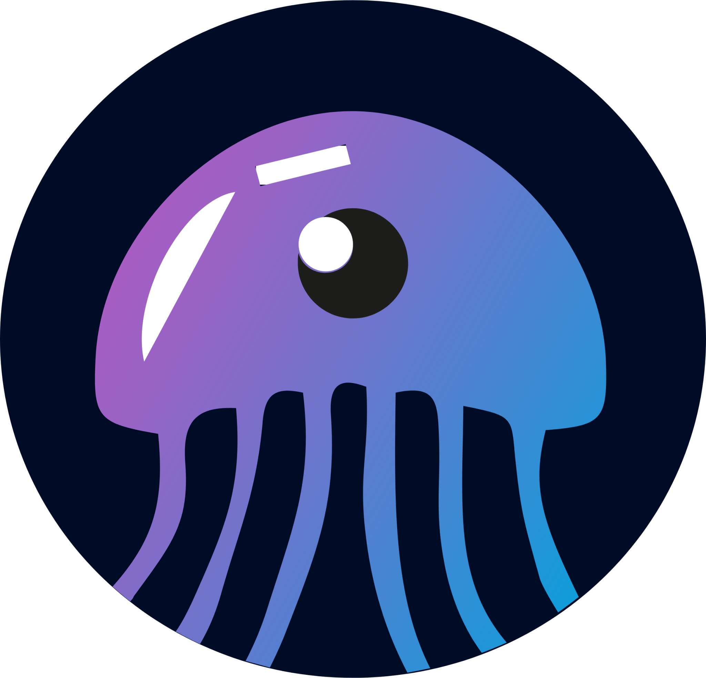

<html lang="en">
<head>
  <meta charset="UTF-8">
  <meta name="viewport" content="width=device-width, initial-scale=1">
  <title>Schermer42 Apps</title>
  <link rel="stylesheet" href="https://cdn.jsdelivr.net/npm/@picocss/pico@1/css/pico.min.css">
  
</head>
<body>
  

    <header>
      <h1>Self-Hosted Apps voor Familie</h1>
      <h2>Klik op een app voor meer informatie</h2>
    </header>
    

      

        
        <h3>Jellyfin</h3>
        <a href="https://jellyfin.org" target="_blank">Open Jellyfin</a>
        
Username: Horstjes   Password: Ster2006

      

      

        
        <h3>Jellyseerr</h3>
        <a href="https://github.com/Fallenbagel/jellyseerr" target="_blank">Open Jellyseerr</a>
        
Username: Horstjes   Password: Ster2006

      

      

        
        <h3>Immich</h3>
        <a href="https://immich.app" target="_blank">Open Immich</a>
        
Username: user789   Password: pass789

      

      

        
        <h3>NAS Schermer42</h3>
        <a href="#" target="_blank">Instructies voor NAS</a>
        
Username: nasuser   Password: naspass

      

    

  

</body>
</html>
